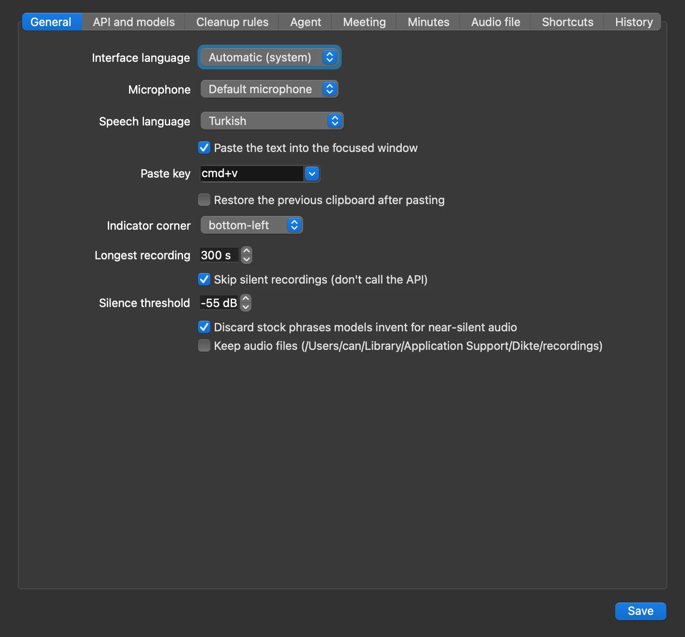
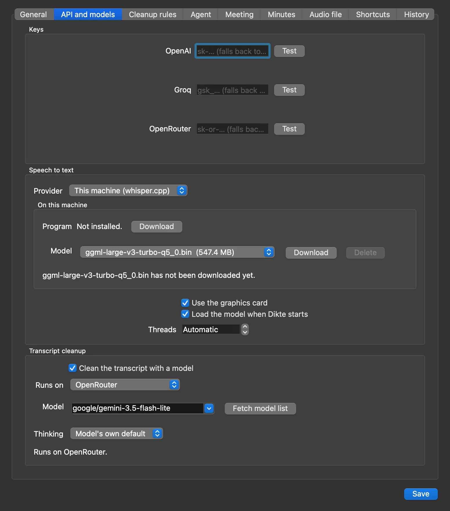
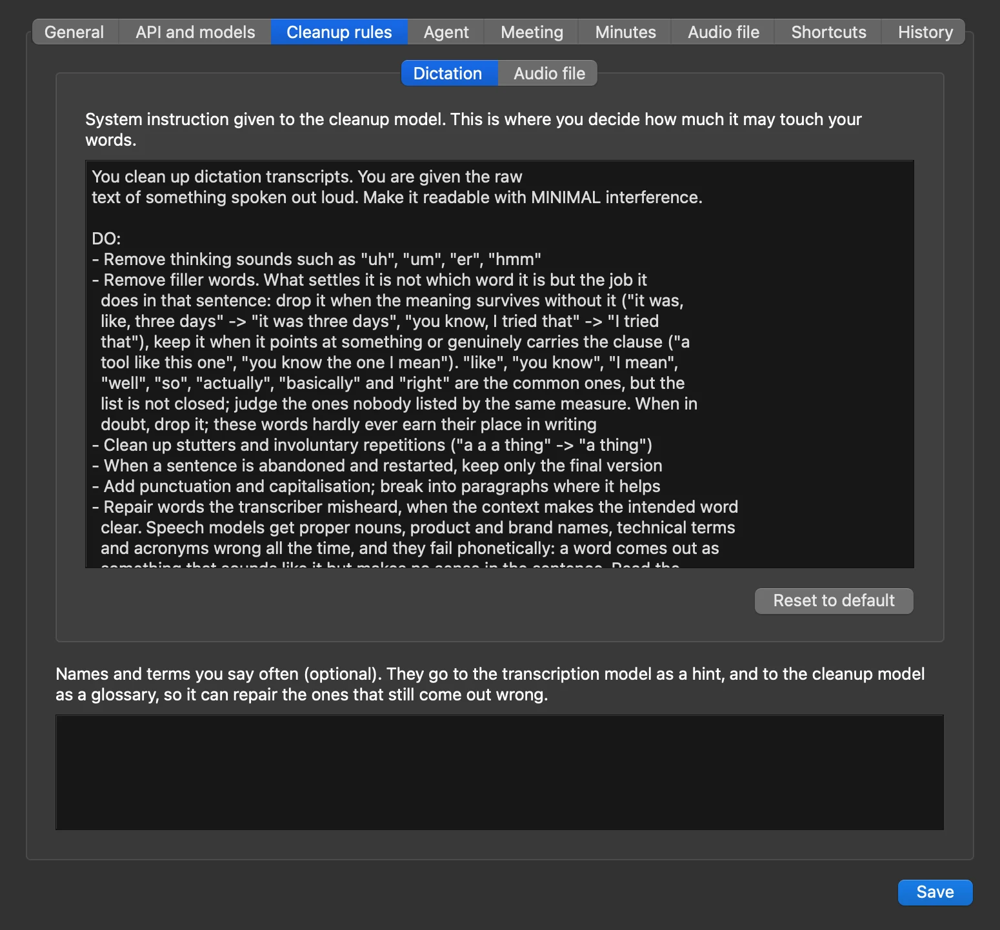
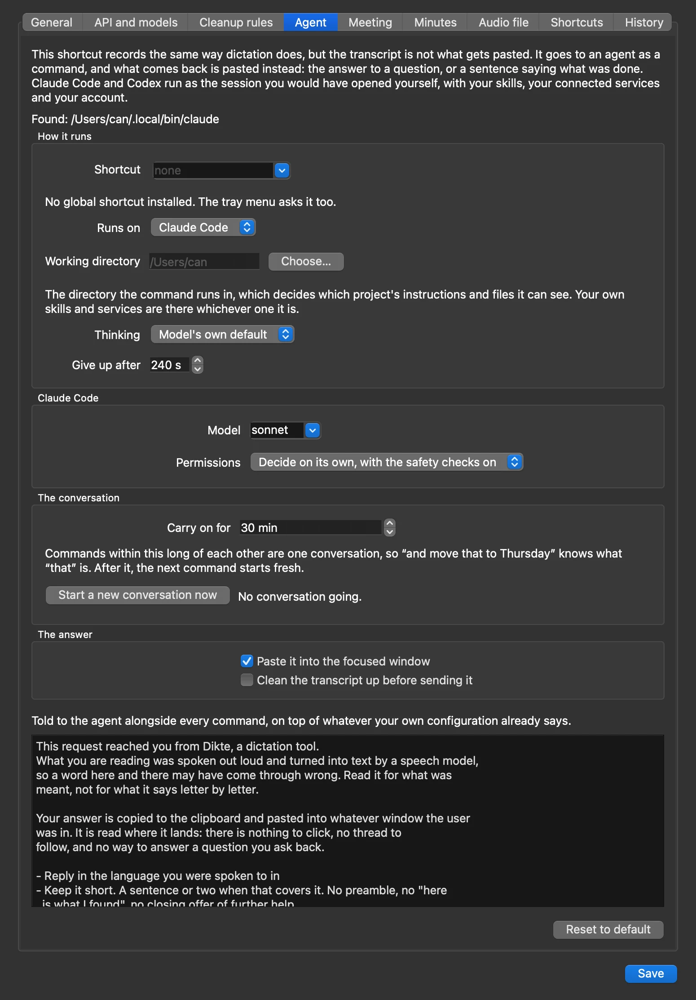
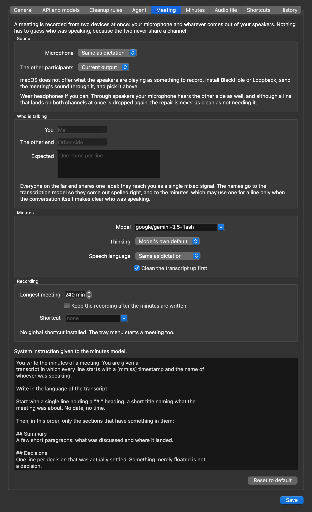
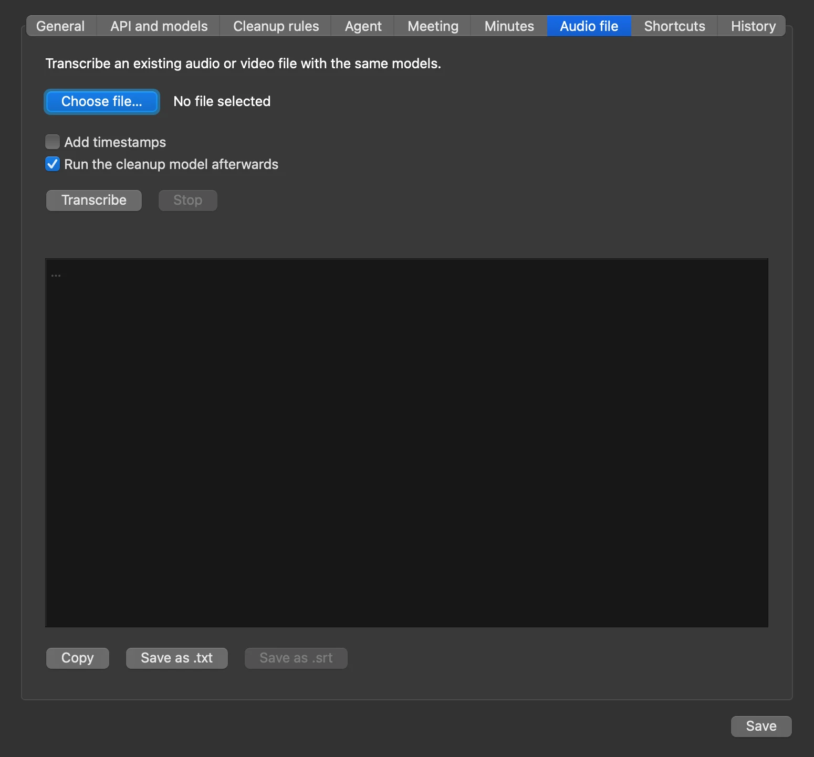
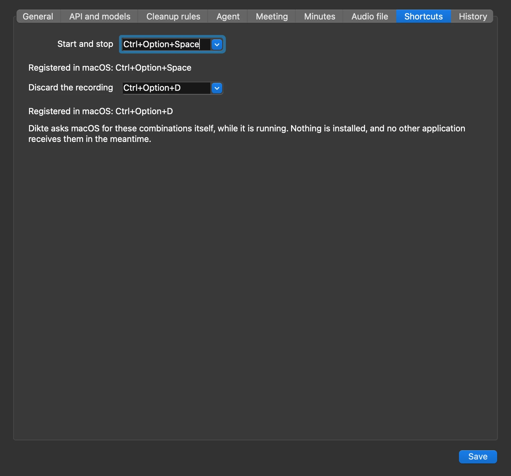

# Dikte

Press `Ctrl+Space`, talk, press again. The recording is transcribed on this
machine by default, a model cleans it up (dropping the *uh*s, the restarts, the
missing punctuation), and the result lands in your clipboard and is pasted into
whatever window you were typing in.

Built for KDE Plasma 6 on Wayland, and runs on GNOME X11 and macOS too. No
dependencies beyond system packages: just the Python standard library, 3.11 or
newer, and PyQt6.

*[Türkçe README](README.tr.md)*

<p align="center">
  
</p>

|  |  |
|---|---|
|  |  |
|  |  |
|  |  |

## Install

```sh
sudo pacman -S --needed pipewire-audio wl-clipboard ydotool ffmpeg python-pyqt6
systemctl --user enable --now ydotool     # needed for auto-paste

./install.sh                 # or:  ./install.sh "Meta+Space" "Meta+Shift+Space"
dikte                        # the settings window opens on first run
```

On Fedora the packages are named differently, `ffmpeg-free` out of Fedora's own
repositories is enough because Dikte only ever takes the audio track of a video
file, and `ydotool` takes one step more: it ships as a system service, whose
socket stays root-owned and out of your session's reach, so auto-paste fails
with the daemon running. Point it at the path the client already looks at and
hand the socket over:

```sh
sudo dnf install pipewire-utils wl-clipboard ydotool ffmpeg-free python3-pyqt6
sudo mkdir -p /etc/systemd/system/ydotool.service.d
printf '[Service]\nExecStart=\nExecStart=/usr/bin/ydotoold --socket-path=%s/.ydotool_socket --socket-own=%s:%s\n' \
  "$XDG_RUNTIME_DIR" "$(id -u)" "$(id -g)" \
  | sudo tee /etc/systemd/system/ydotool.service.d/override.conf >/dev/null
sudo systemctl daemon-reload
sudo systemctl enable --now ydotool
```

On Ubuntu/GNOME X11, recording uses PulseAudio and clipboard/paste use the X11
tools instead:

```sh
sudo apt install pulseaudio-utils xclip xdotool ffmpeg
```

On macOS the same `./install.sh` runs and hands over to `install-mac.sh`, which
puts down a `Dikte.app` in `~/Applications`, the `dikte` command and a
LaunchAgent:

```sh
brew install pyqt ffmpeg   # pyqt brings a Python newer than Apple's 3.9 with it

./install.sh               # or:  ./install.sh "Ctrl+Option+Space" "Ctrl+Option+D"
open -a Dikte
```

The bundle is what macOS files the **Microphone** and **Accessibility**
permissions against, and it asks for each the first time it needs one. The
default there is `Ctrl+Option+Space`, since macOS keeps `Ctrl+Space` for the
input-source switch, and nothing needs a logout: Dikte holds the combination
itself while it runs. PyQt6 comes from brew rather than pip because Homebrew's
Python refuses to be installed into, and `DIKTE_PYTHON=…/venv/bin/python
./install.sh` points the installer at a virtualenv instead.

Local speech to text is the one piece that has to be built by hand there:
whisper.cpp publishes no macOS binary and Homebrew's is configured with
`WHISPER_BUILD_SERVER=OFF`, so it installs `whisper-cli` and not the server
Dikte talks to. Build it (`cmake -B build -DWHISPER_BUILD_SERVER=ON
-DGGML_METAL=ON && cmake --build build -j`) and give Settings → API the path, or
transcribe in the cloud. A meeting needs BlackHole or Loopback
(`brew install blackhole-2ch`); dictation does not.

`install.sh` adds the `dikte` command, a menu entry, an autostart entry and the
two global shortcuts, whose keys are its two arguments. `./update.sh` pulls and
puts all of that back, keeping the keys you chose; `./uninstall.sh` takes it away
again and leaves your settings and dictations alone unless you pass `--purge`.

Speech to text and cleanup each pick a provider in the settings window, and both
run here by default, on models of your own. The cloud is the other option:
speech to text on **OpenAI**, **Groq** or **OpenRouter** (`gpt-4o-transcribe`),
cleanup on OpenRouter (`google/gemini-3.5-flash-lite`) or, when either is
installed, on Claude Code or Codex. The keys fall back to `OPENAI_API_KEY`,
`GROQ_API_KEY` and `OPENROUTER_API_KEY`, and are stored in
`~/.config/dikte/config.json`, mode 600, or in
`~/Library/Application Support/Dikte` on a Mac. Cleanup can be switched off, in
which case the raw transcript is pasted, and a thinking model's effort can be
set next to it.

## Using it

| What | How |
| --- | --- |
| Start / stop recording | `Ctrl+Space`, or click the tray icon |
| Discard the recording | `Ctrl+Alt+Space`, tray menu, or `dikte cancel` |
| Speak a command to an agent | Tray menu → *Ask Claude*, or `dikte ask` |
| Start / end a meeting | Tray menu → *Record a meeting*, or `dikte meeting` |
| Settings | Tray menu → *Settings*, or `dikte settings` |
| Reload after an update | Tray menu → *Restart*, or `dikte restart` |
| Quit | Tray menu → *Quit*, or `dikte quit` |

An indicator in the screen corner shows a red dot, a live waveform and the
elapsed time, then the stage it is on. It never takes focus. Pressing
`Ctrl+Space` again while Dikte is still working does nothing; nothing queues up.
A dictation and a command to the agent do wait on each other for the microphone,
which is one device, but for nothing else: each has its own indicator, and the
second one stacks above the first while both are up.

Everything the settings window holds has a verb of its own too, so a script or
an agent can work the whole thing: `dikte record --seconds 8` says back what was
said, `dikte transcribe talk.mp4 --srt` writes subtitles, and the settings, the
history and the meetings are there beside them. `dikte --help` lists them, they
all take `--json`, and only the ones needing the microphone need the application
running.

## What it does

- **It all runs on this machine by default.** Speech to text on whisper.cpp and
  cleanup on llama.cpp, neither installed beforehand: the settings window fetches
  the program and the model, verifies the sha256 and refuses a download published
  without one, then keeps a server alive while you dictate. The graphics card is
  reached through CUDA, ROCm or Vulkan where the build allows. No key, no
  account, nothing leaving the machine.
- **Silence never reaches the API.** Handed near-silence, a transcription model
  invents a sentence instead of returning nothing ("Thanks for watching", or in
  Turkish "Altyazı M.K."). A recording is dropped when nothing rose 10 dB above
  *that recording's own* noise floor for at least 0.3 s, which is also what
  removes steady fan noise however loud, or when its loud end sits below
  -55 dBFS. The indicator reports the level it measured, which is what you
  calibrate the threshold against.
- **Misheard words are repaired.** Speech models fail phonetically on proper
  nouns, so the cleanup model is asked to fix those from context, and to leave
  the word alone when the context does not make the intended one clear. The names
  you list under Cleanup rules go to the transcription model as a hint and to the
  cleanup model as a glossary, which is what lets it recognise "kuber netis":

  ```
  raw    ıı bugün şey kuber netis üzerinde çalışan servisleri güncelledim
         yani sonra grafanada bir panel açtım hani ve pay kut ile arayüzü
         şey bitirdim işte

  result Bugün Kubernetes üzerinde çalışan servisleri güncelledim. Sonra
         Grafana'da bir panel açtım ve PyQt ile arayüzü bitirdim.
  ```
- **A failed cleanup is never silent.** The raw transcript is still pasted so the
  dictation is not lost, but the indicator turns amber with the reason instead of
  looking like a normal run.
- **A dictation can be a command instead.** Its own shortcut sends the
  transcript to Claude Code (`claude -p`) rather than pasting it, and pastes back
  what comes of it: the answer, or a sentence saying what was done. It is the
  session you would have opened yourself, so your skills and connected services
  are there, which is what makes "put that in my calendar on Thursday at three"
  a thing you can say to a window that is not Claude. Codex (`codex exec`) runs
  the same way, and OpenRouter is there as a plain question-and-answer fallback
  for a machine with neither CLI on it. Provider, model, permissions and working
  directory are under Settings → Agent, and commands close together stay in one
  conversation.
- **Meetings** are recorded from the microphone and the speaker output at the
  same time, which settles who said what by the channel a voice arrived on
  instead of guessing at it. The two sides are transcribed separately and
  interleaved into one timestamped transcript, and a second model, configured
  under Settings → Meeting along with its own instruction, turns that into
  minutes: decisions, action items, open questions. They land in
  `~/.local/share/dikte/meetings` and in Settings → Minutes. A run that fails
  keeps its recording, and a retry resumes from the transcript it already paid
  for.
- **Audio and video files** run through the same models under Settings → Audio
  file, optionally with `[mm:ss]` timestamps, chunked through ffmpeg when long,
  and saved as `.txt` or as `.srt` subtitles; their cleanup follows its own rules,
  written for subtitles, so the lines keep their place and nothing is shortened.
- **History** of every dictation under Settings → History, with a size limit and
  right-click to delete.
- **Turkish and English interface**, following the system locale by default.

## The global shortcuts need one logout

KWin only reads `kglobalshortcutsrc` at startup, so the shortcuts `install.sh`
writes will not fire until you log out and back in. Until then, Settings →
Shortcuts → **built-in listener** reads `/dev/input` and catches the combination
itself. The difference: it does not swallow the key, so `Ctrl+Space` also reaches
the focused application (some editors will pop up autocomplete). The listener
needs your user in the `input` group: `sudo usermod -aG input $USER`.

## Layout

```
dikte.py          entry point, tray icon, state machine
cli.py            the command line: every verb, and what it answers with
ipc.py            one request and one reply over the local socket
audio.py          PCM capture: pw-record for dictation, ffmpeg for a meeting
meeting.py        channel split, speaker labelling, cleanup, minutes
assistant.py      running a dictation through Claude Code, Codex or OpenRouter
api.py            transcription and cleanup requests (stdlib only)
cleanup.py        who rewrites the transcript: OpenRouter, here, Claude or Codex
ggml.py           whisper.cpp and llama.cpp here: fetch, verify, keep serving
hub.py            what GitHub and Hugging Face have on offer today
worker.py         transcribe → clean up → clipboard → paste
vad.py            deciding whether a recording holds speech at all
filetranscribe.py file transcription: ffmpeg, chunking, timestamps
overlay.py        the corner indicator
settings_ui.py    settings window
hotkey.py         KDE shortcut installation, the evdev listener, Carbon on a Mac
paste.py          wl-clipboard and ydotool wrappers, pbcopy and CoreGraphics
trayicon.py       the tray icons, drawn where there is no icon theme
i18n.py           the string table
```

The indicator is drawn through XWayland, because a Wayland client cannot place a
window in a screen corner; `dikte.py` sets `QT_QPA_PLATFORM=xcb` for that.

## License

GPL-3.0, see [LICENSE](LICENSE).
